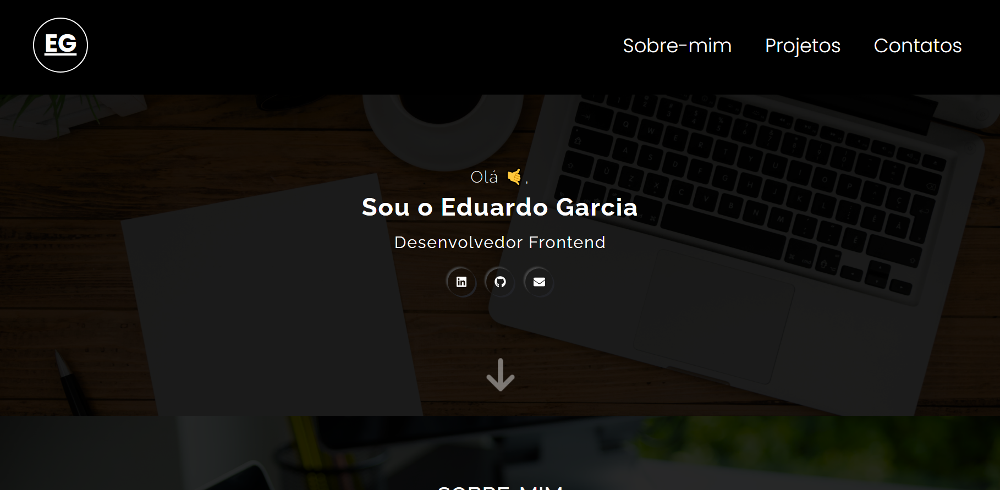

# Portfólio 📚
Esse projeto é meu portfólio com alguns projetos meus, descrevendo cada um deles, no portifólio conto um pouco mais sobre mim, possui também algumas formas de contatos, caso queira entrar em contato comigo.

## Objetivo 📌
O objetivo desse portfólio é mostrar minha forma de programar e o uso de cada linguagem, fremeworks e bibliotecas que utilizo, as decisões que tomo durante os projetos. E busco minha primeira vaga de emprego como programdor

## Linguagens utilizadas 👨‍💻
- HTML
- CSS
